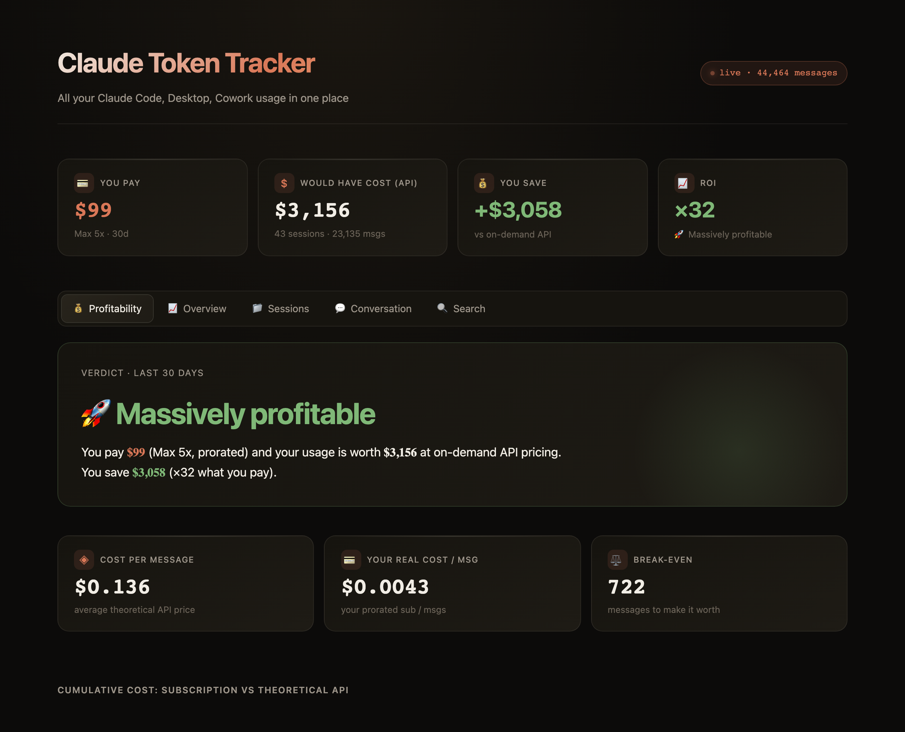
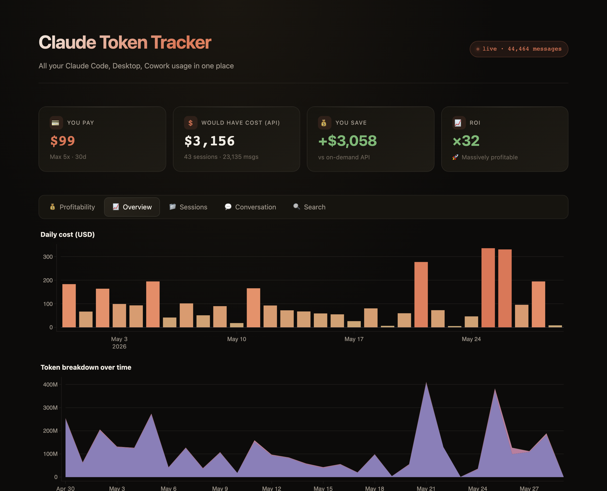

# Claude Token Tracker

A local, privacy-first dashboard to track **all your Claude Code usage** — tokens, costs, and conversations — across the CLI, VS Code, Desktop, Cowork and sub-agents.

It reads the session logs Claude Code writes to `~/.claude/projects/` (the JSONL format shared by every Claude Code surface), aggregates them into a local SQLite database, and serves an interactive Streamlit dashboard. **Nothing leaves your machine.**



> Dark, smooth dashboard — Profitability, Overview, Sessions, Conversation and Search tabs, in EN / FR / AR.



## Why

Claude Code subscriptions (Pro, Max) are flat monthly plans, but every message reports its exact token `usage`. This tool answers:

- How many tokens / how much would my usage cost at on-demand API rates?
- **Is my subscription worth it?** (ROI vs. what the same usage would cost via the API)
- Which projects / models / sessions burn the most?
- What did I actually send and receive, message by message?

## Features

- **Profitability tab** — compares your real subscription cost against the theoretical API cost of your usage, with a clear verdict, break-even point, cumulative chart and monthly breakdown.
- **Overview** — daily cost, token breakdown over time, cost by model / entrypoint / project.
- **Sessions** — sortable table of every session with duration, tokens and cost.
- **Conversation** — read any session message-by-message (ChatGPT-style bubbles) with per-message token counts and cost.
- **Search** — full-text search across every prompt and answer, with highlighting.
- **Filters** — time range presets (7 / 30 / 90 days / all / custom), project, model, entrypoint.
- **3 languages** — English, Français, العربية (Modern Standard Arabic, RTL).
- **Accurate pricing** — verified against the official Anthropic price list, including the Opus 4.5+ price drop and 5-minute vs. 1-hour cache write rates.

## Install

Requires Python 3.10+.

```bash
git clone https://github.com/miloudbelarebia/claude-token-tracker.git
cd claude-token-tracker

python3 -m venv .venv
source .venv/bin/activate          # Windows: .venv\Scripts\activate
pip install -r requirements.txt
```

## Usage

One command (parses your sessions, then launches the dashboard):

```bash
./run.sh
```

Or in two steps:

```bash
python3 tracker.py                 # parse ~/.claude/projects/**/*.jsonl into SQLite
python3 -m streamlit run app.py    # open the dashboard at http://localhost:8501
```

After new Claude Code activity, click **"⚙️ Re-parse sessions"** in the sidebar (or re-run `tracker.py`) to refresh.

Set your subscription plan and interface language in the sidebar — they persist in `data/config.json`.

## How costs are computed

Each assistant message stores the token `usage` reported by the Claude API. For every message:

```
cost = ( input_tokens      × input_price
       + output_tokens     × output_price
       + cache_read_tokens × input_price × 0.10
       + cache_write_5min  × input_price × 1.25
       + cache_write_1h    × input_price × 2.00 ) / 1_000_000
```

The cache multipliers (0.1× read, 1.25× 5-min write, 2× 1-hour write) are Anthropic's universal rules, so they hold for every model. The parser reads the `ephemeral_5m` / `ephemeral_1h` breakdown of each message to apply the right write multiplier.

See **[docs/PRICING.md](docs/PRICING.md)** for the full method, sources, and a cross-check against Anthropic's own worked example.

### Pricing (USD per 1M tokens)

Verified against [the official Anthropic pricing page](https://platform.claude.com/docs/en/about-claude/pricing) (May 2026).

| Model | Input | Output |
|---|---|---|
| **Opus 4.5 / 4.6 / 4.7** | $5 | $25 |
| Opus 4 / 4.1 (deprecated) | $15 | $75 |
| Sonnet 4 / 4.5 / 4.6 | $3 | $15 |
| Haiku 4.5 | $1 | $5 |
| Haiku 3.5 | $0.80 | $4 |

> **Note:** Anthropic cut the Opus price by 3× starting with Opus 4.5 ($15→$5 input, $75→$25 output). The parser auto-detects model versions and applies the correct rate. Edit the `PRICING` dict in `tracker.py` if your rates differ (enterprise, AWS Bedrock, Vertex AI, discounts).

The displayed **cost is theoretical** — it's what your usage *would* cost at pay-as-you-go API rates, not what you actually pay on a flat subscription. The whole point is to compare the two.

## Project structure

```
claude-token-tracker/
├── tracker.py             # JSONL parser → SQLite, with cost computation
├── app.py                 # Streamlit dashboard
├── i18n.py                # translations (EN / FR / AR)
├── requirements.txt
├── run.sh                 # parse + launch
├── LICENSE                # MIT
├── tests/
│   └── test_pricing.py    # unit tests for cost & model classification
├── docs/
│   └── PRICING.md         # pricing method + official sources
└── data/
    ├── config.example.json
    ├── config.json        # your plan + language (gitignored)
    └── tracker.db         # local SQLite (gitignored)
```

## Privacy

- 100% local. The dashboard runs on `localhost`, the database is a local SQLite file, and your session logs never leave your machine.
- `data/` (your database and config) is gitignored — your prompts and usage are never committed.

## Limitations

- **Claude.ai (web chat)** doesn't write local logs, so it isn't included. You could import a data export (Settings → Privacy → Export) to add it.
- Costs don't reflect enterprise discounts, Batch API (−50%), or third-party platforms (Bedrock, Vertex).
- Future models not yet in `PRICING` fall back to a Sonnet-equivalent estimate until you add their rate.

## Tests

Pricing logic is covered by unit tests (no extra dependencies — stdlib `unittest`):

```bash
python -m unittest discover -s tests -v
# or, with pytest:
python -m pytest tests/ -v
```

The cost tests assert against Anthropic's official worked example, so any drift
from the published rates fails the suite.

## Contributing

Issues and PRs welcome. Ideas: claude.ai export importer, CSV/JSON export, more currencies, packaging as a `pipx` CLI.

## License

[MIT](LICENSE) © Miloud Belarebia
